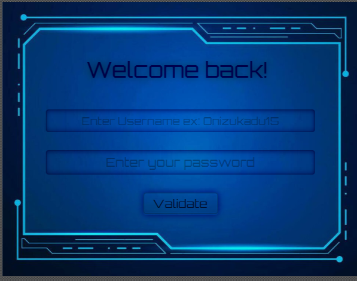
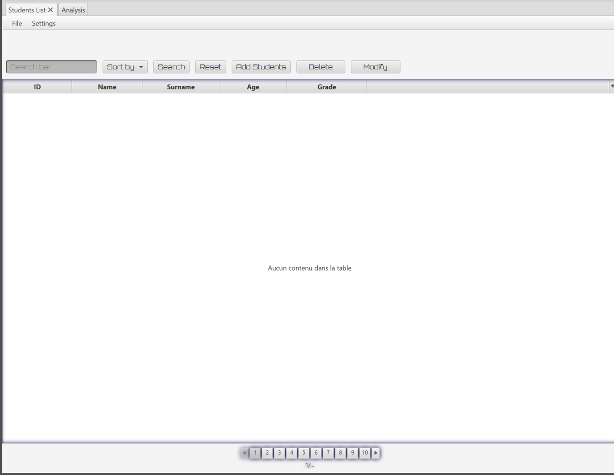

# 🎓 La Plateforme_ Tracker

> A Java student management application built as a team project, featuring a JavaFX interface connected to a PostgreSQL database.

---

## 📸 Preview

| Login                             | Dashboard                     |
|-----------------------------------|-------------------------------|
|  |  |

---

## 🛠️ Tech Stack

| Layer | Technology |
|-------|------------|
| Language | Java 21 |
| UI Framework | JavaFX + FXML |
| Database | PostgreSQL |
| DB Connector | JDBC |
| Version Control | Git / GitHub |

---

## ✅ Features

- ➕ Add, ✏️ edit, 🗑️ delete a student
- 🔍 Search by ID and advanced search (age, grade average...)
- 🔃 Dynamic sorting (name, surname, age, grade)
- 📄 Paginated display
- 📊 Statistics: class average, age distribution
- 📁 Import / Export in CSV, XML, JSON
- 📤 Export results to CSV, PDF or HTML
- 🔐 Authentication (username + password)
- 💾 Auto-save at regular intervals

---

## 👥 Team & Responsibilities

| Member | Role |
|--------|------|
| [@mahira-manico](https://github.com/mahira-manico) | All FXML files · Main Controller |
| [@moinahalima-abdou](https://github.com/moinahalima-abdou) | Login Controller · Student Controller |
| [@samba-gomis](https://github.com/samba-gomis) | PostgreSQL database · DAO layer · Models |

---

## ⚙️ Prerequisites

- Java JDK 21+
- PostgreSQL
- Git
- IntelliJ IDEA or VS Code

---

## 🚀 Getting Started

```bash
# Clone the repository
git clone https://github.com/mahira-manico/LaplateformeTracker.git
cd LaplateformeTracker

# Add the PostgreSQL JDBC driver to your classpath
# Download the .jar at https://jdbc.postgresql.org/
```

---

## 🗄️ Database Setup

```sql
-- Create the database
CREATE DATABASE laplateforme_tracker;

-- Create the student table
CREATE TABLE student (
    id         SERIAL PRIMARY KEY,
    first_name VARCHAR(100) NOT NULL,
    last_name  VARCHAR(100) NOT NULL,
    age        INTEGER NOT NULL,
    grade      DECIMAL(5, 2)
);
```

In `DatabaseConnection.java`, update the connection settings:

```java
private static final String URL      = "jdbc:postgresql://localhost:5432/laplateforme_tracker";
private static final String USER     = "your_username";
private static final String PASSWORD = "your_password";
```

---

## ▶️ Run the App

```bash
javac -cp .:postgresql-driver.jar src/**/*.java
java  -cp .:postgresql-driver.jar Main
```

Or run `Main.java` directly from your IDE.

---

## 🔒 Security

- `PreparedStatement` on all queries to prevent SQL injection
- Mandatory authentication on startup
- Exception handling on all database operations